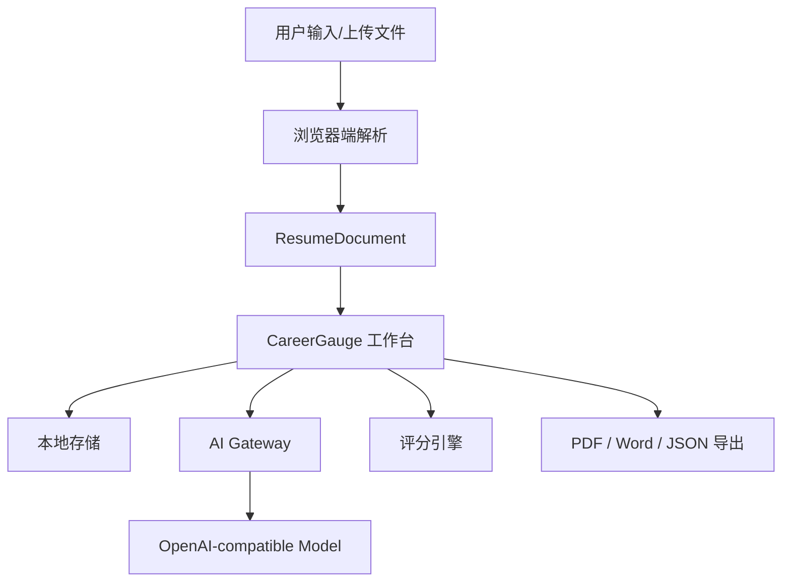

# CareerGauge

CareerGauge 是一个面向中文校招、实习和早期职业阶段的 AI 简历优化项目。项目以结构化简历数据为核心，覆盖简历导入、在线编辑、AI 优化、JD 匹配评分、模板预览和文件导出流程。

## 功能概览

| 模块 | 能力 | 当前实现 |
| --- | --- | --- |
| 简历导入 | 支持 JSON、Word、PDF 简历导入并转为可编辑字段 | 已支持 |
| 结构化编辑 | 编辑基础信息、教育经历、实习经历、项目经历、校园经历、技能、奖项等模块 | 已支持 |
| AI 优化 | 简历生成、模块润色、关键词推荐、模块诊断 | 已支持 |
| JD 匹配 | 基于目标岗位/JD 分析关键词覆盖和内容匹配度 | 已支持 |
| 简历评分 | ATS 兼容性、内容完整度、关键词匹配、量化成果、总结质量、可读性评分 | 已支持 |
| 模板预览 | 多套中文简历模板、模块排序、样式和图标设置 | 已支持 |
| 文件导出 | PDF 打印导出、Word 导出、JSON 备份导入导出 | 已支持 |
| 本地保存 | 匿名会话、本地草稿保存、多份简历管理 | 已支持 |
| 反馈分析 | 用户反馈采集、轻量数据指标看板 | 已支持 |

## 产品流程


## 技术栈

| 类型 | 技术 |
| --- | --- |
| 应用框架 | Next.js 16 App Router |
| 前端 | React 19、TypeScript、Lucide React |
| 简历解析 | Mammoth、pdfjs-dist |
| AI 接入 | OpenAI-compatible Chat Completions API |
| 部署 | OpenNext Cloudflare、Wrangler |
| 质量检查 | ESLint、TypeScript |

## 目录结构

| 路径 | 说明 |
| --- | --- |
| `src/app` | Next.js 页面、布局和 API 路由 |
| `src/features/workspace` | CareerGauge 简历工作台主界面 |
| `src/lib/ai` | AI 网关、Prompt、Provider 和任务类型 |
| `src/lib/resume-schema` | 简历数据结构、默认值和校验 |
| `src/lib/scoring` | 简历评分规则引擎 |
| `src/lib/export` | PDF、Word、JSON 导出能力 |
| `src/lib/storage` | 本地简历存储 |
| `src/lib/analytics` | 产品使用事件和看板指标 |
| `src/lib/feedback` | 用户反馈存储 |
| `docs` | 产品规格、部署记录和简历优化规范 |
| `skills` | 可复用的简历优化 AI Skill 文档 |

## 本地开发

### 环境要求

| 工具 | 建议版本 |
| --- | --- |
| Node.js | 20+ |
| npm | 随 Node.js 安装 |

### 启动

```bash
npm install
npm run dev
```

默认访问：

```text
http://localhost:3000
```

### 常用命令

| 命令 | 说明 |
| --- | --- |
| `npm run dev` | 启动本地开发服务 |
| `npm run build` | 构建 Next.js 应用 |
| `npm run start` | 启动生产构建 |
| `npm run lint` | 运行 ESLint |
| `npm run typecheck` | 运行 TypeScript 类型检查 |
| `npm run pages:build` | 使用 OpenNext 构建 Cloudflare Worker |
| `npm run pages:dev` | 本地运行 Cloudflare Pages/Worker 预览 |
| `npm run pages:deploy` | 部署到 Cloudflare |

## AI 配置

项目通过 OpenAI-compatible 接口调用模型。可使用 OpenAI、DeepSeek 或其它兼容 Chat Completions API 的服务。

| 变量 | 说明 | 默认值 |
| --- | --- | --- |
| `AI_GATEWAY_API_KEY` | AI 服务 API Key | 无 |
| `AI_GATEWAY_BASE_URL` | API Base URL | `https://api.openai.com/v1` |
| `AI_GATEWAY_MODEL` | 模型名称 | `gpt-4o-mini` |
| `AI_GATEWAY_PROVIDER_NAME` | Provider 展示名 | `openai-compatible` |
| `OPENAI_API_KEY` | OpenAI API Key 兼容变量 | 无 |
| `OPENAI_MODEL` | OpenAI 模型兼容变量 | 无 |

Cloudflare 部署时，`wrangler.toml` 已配置 DeepSeek 兼容接口的基础变量；API Key 建议通过 Wrangler Secret 配置。

```bash
npx wrangler secret put AI_GATEWAY_API_KEY
```

## 核心数据流



## 项目定位

| 维度 | 说明 |
| --- | --- |
| 目标用户 | 中文校招、实习、应届生、早期职业阶段求职者 |
| 主要场景 | 从零生成简历、优化已有简历、针对 JD 定制表达、导出投递版本 |
| 数据策略 | 默认匿名使用，简历草稿优先保存在浏览器本地 |
| 优化重点 | ATS 友好、岗位关键词、经历量化、成果表达、结构清晰 |

## 文档与 Skill

| 文件 | 说明 |
| --- | --- |
| `docs/superpowers/specs/2026-05-21-resumelm-design.md` | 产品设计规格 |
| `docs/superpowers/plans/2026-05-21-resumelm-implementation-plan.md` | 实施计划 |
| `docs/简历解析修改规范.md` | 简历解析优化规范 |
| `docs/简历修改规范更新版.md` | 简历内容修改规范 |
| `skills/careergauge-resumeAI-opt.md` | 中文简历优化 Skill |
| `skills/careergauge-resumeAI-opt-eng.md` | 英文简历优化 Skill |

## 部署

```bash
npm run pages:build
npm run pages:deploy
```

部署前请确认：

| 检查项 | 说明 |
| --- | --- |
| AI Key | 已通过 `wrangler secret put AI_GATEWAY_API_KEY` 配置 |
| 构建产物 | `npm run pages:build` 正常完成 |
| 类型检查 | `npm run typecheck` 无错误 |
| 代码检查 | `npm run lint` 无错误 |

## License

当前仓库未声明开源许可证。如需对外开源或商业复用，请先补充明确的 License。
